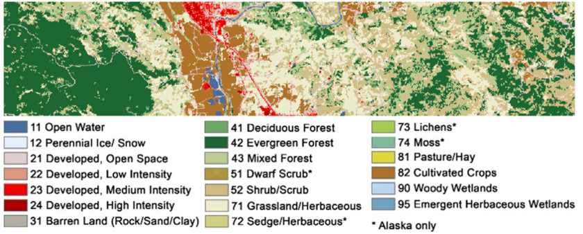

# Contents

The script of this seminar bases on data from this tutorial of random forest based regression in the ENMAP toolbox, which is a extension for QGIS. So if you like, you may try the toolbox as well. You may further information here:
[https://enmap-box.readthedocs.io/en/latest/usr_section/application_tutorials/biomass_regression/tutorial.html](https://enmap-box.readthedocs.io/en/latest/usr_section/application_tutorials/biomass_regression/tutorial.html)

Forest aboveground biomass (AGB) is a measure of the living and dead plant material in a given area. As such, it is often used for forest management, assessing fire potential, and is an important metric used in modelling carbon and nutrient cycles. AGB can be directly measured at a plot level by harvesting and weighing vegetation, but this is both an expensive and highly invasive process. Through the use of statistical modelling and remotely sensed imagery, AGB can be mapped across broad, spatially continuous areas using only a small number of directly measured reference plots.

The tutorial data contains a simulated hyperspectral EnMAP image, plot-based above ground biomass (AGB) references as well as a land cover map for a small study area located in Sonoma County, California, USA.

The simulated EnMAP image is a subset extracted from the “2013 Simulated EnMAP Mosaics for the San Francisco Bay Area, USA” dataset [1]. AGB reference data was sampled from an existing LiDAR derived AGB map [2]. The land cover map was taken from the 2011 National Landcover Database (NLCD) [3].



The Environmental Mapping and Analysis Program (EnMAP) is a German hyperspectral satellite mission that aims at monitoring and characterizing Earth’s environment on a global scale.

More information about the EnMAP mission can be found here: [https://www.enmap.org/](https://www.enmap.org/)

The satellite finally started its mission in summer 2022 and data can be acquired by registered users.

---

# Preparation

**Packages, Working directory and reading the data.**

Open the required packages `terra` and `randomforest`.

```r
#install.packages("terra")
#install.packages("randomForest")
library(terra)
library(randomForest)
```

Open a new workspace and set the working directory.

```r
setwd("PATH_TO_YOUR_WORKING_DIRECTORY")
```

## Reading the data

Read the simulated EnMap image. In this case, the data are provided in the typical ENVI format (generic binary), which consists of the data itself (“enmap_sonoma.bsq”) and the metadata (“enmap_sonoma.hdr”).

```r
enmap.image <- rast("enmap_sonoma.bsq")
```

Create a vector of the center wavelengths of the simulated EnMAP bands (which differ slightly from the true EnMAP wavelengths). Have a look in the header-file to find the information.

```r
wl.valid <- c(423,  429,  434,  440,  445,  450,  455,  460,  464,  469,  474,  479,  484,  488,  493,  498,  503,  508,  513,  518,  523,  528,  533,  538,   543,  548,  553,  559,  564,  569,  575,  580,  586,  592,  597,  603,  609,  615,  621,  627,  633,  639,  645,  652,  658,  665,  671,  678,   685,  691,  698,  705,  712,  719,  726,  733,  740,  748,  755,  762,  770,  777,  785,  793,  800,  808,  816,  823,  831,  839,  847,  855,   863,  871,  879,  887,  895,  903,  905,  911,  914,  920,  924,  928,  954,  961,  965,  969,  975,  977,  985,  986,  996, 1007, 1018, 1029,  1040, 1051, 1063, 1074, 1085, 1097, 1109, 1120, 1132, 1144, 1155, 1167, 1179, 1191, 1203, 1215, 1227, 1239, 1251, 1263, 1275, 1287, 1299, 1476,  1488, 1499, 1511, 1522, 1534, 1545, 1556, 1568, 1579, 1590, 1601, 1612, 1623, 1634, 1645, 1656, 1667, 1678, 1689, 1699, 1710, 1721, 1731, 1742,  1752, 1762, 1773, 2053, 2062, 2071, 2080, 2089, 2098, 2106, 2115, 2124, 2133, 2141, 2150, 2159, 2167, 2176, 2184, 2193, 2201, 2209, 2218, 2226,  2234, 2243, 2251, 2259, 2267, 2275, 2283, 2291, 2299, 2307, 2315, 2323, 2331, 2339, 2347, 2355, 2363, 2370, 2378, 2386, 2393, 2401, 2409, 2416,  2424, 2431, 2439)
```

Read the vector data containing the reference measurements of biomass (“agb_sonoma.gpkg”). gpkg is a typical vector format of QGIS.

```r
biomass <- vect("agb_sonoma.gpkg")
```

Have a look a the attribute table.

```r
View(values(biomass))
```

- **Homework task 1:** Plot one band of the image and overlay the positions of the biomass plots.

```r
#your code
```

## Extract training data for the random forest model

- **Homework task 2:** Extract the spectra of the simulated EnMAP image at the locations of the biomass reference data. The spectral information is used to predict the biomass.

```r
#your code
```

- **Homework task 3:** Plot the extracted spectral signatures for all reference points. The data are scaled between 0 (0%) reflectance and 10000 (100% reflectance). Scale the data from 0 to 100% for plotting.

Color the spectra according to their biomass (you might e.g. build biomass classes that you may define yourself). In my example I only plotted the data quite randomly.

```r
for (i in 1:nrow(enmap.extract)){

  par(new=T) 
  plot(wl.valid, enmap.extract[i,2:196]/100, type="l", 
       col=biomass$biomass[i],  ylim=c(0,40), 
       ylab="Reflectance (%)", xlab="wavelength (nm)")

}
```

We have to tidy up the data and build a data.frame of the training samples to create a model that may predict biomass values.

Basically, we are removing reference data that do not include valid values (that might be due to reference points being located outside the image) and create a data.frame consisting of the biomass data and the associated spectra.

```r
enmap.extract.na <- enmap.extract[rowSums(is.na(enmap.extract[,2:196])) != ncol(enmap.extract[,2:196]),]

wl.names <- paste("n", as.character(wl.valid), sep="")
colnames(enmap.extract.na)[2:196] <- wl.names

biomasse.na <- biomasse[rowSums(is.na(enmap.extract[,2:196])) != ncol(enmap.extract[,2:196]),]

data <- cbind(values(biomasse.na), enmap.extract.na[,2:196])
```

## Apply the random forest model

Train the random forest model using the function `randomForest`.

- **Homework task 4:** What is the default value of `mtry` with a regression? Have a look at the help and use it instead of the value I have assigned.

- **Homework task 5:** 

a) What is the argument `nodesize` and what is the value for classification and regression? How to deal with it in calculating the predicted value? 

b) In random forest classification for the assignment of a class a majority vote is used where the decisions of all trees are considered. How is the regresssion value assigned?

- **Homework task 6:** Isn’t it somehow puzzling that the same function can be used to create a random forest model for classification as well as for regression problems? We are not setting an argument that tells the function what to do … Hence, how does the function know what to do?

There is also the function `tunerf`, which helps to find the best model.

```r
# Simple version
enmap.rf <- randomForest(biomass ~ .,data=data,
                  ntree = 1000, 
                  mtry = 4,
                  importance=T
                  )

# # Tunerf --> fits the best model by altering mtry and ntree
# enmap.tunerf <- tuneRF(data[,2:196],data[,1],
#                   mtryStart = 1,
#                   ntree = 1000, 
#                   importance=T,
#                   doBest = T
#                   )
```

Analyzing the random forest model

- Useful information by executing the object name.

```r
enmap.rf
```

- Looking at the importance of different variables.

```r
varImpPlot(enmap.rf)
```

- Plotting observed biomass values against predicted.

```r
par(pty="s")
plot(biomass.na$biomass, enmap.rf$predicted, xlim=c(0,500), ylim=c(0,500))
```

- **Homework task 7:** What is the value of the explained variance. Explain in general, what the is the explained variance?

Based on the rf model we may now predict the biomass values of the entire image. But first of all we have to make sure that the band names of the image have the same names as the data frame containing the training data.

```r
names(enmap.image) <- names(enmap.extract.na[2:196])
enmap.biomass <- terra::predict(enmap.image, enmap.rf,
                  filename = "sonoma_rf.tif",
                  overwrite = TRUE,
                  na.rm = T
)
```

Plot the resulting image

```r
plot(enmap.biomass)
```

- Save rf model

```r
save(enmap.rf, file = "sonoma_rfmodel.RData")
```

- **Homework task 8:** Calculate a narrow-band index related to vegetation parameters and plot it. Maybe, you find one which is related to biomass? You may find some indices here: [https://www.indexdatabase.de/db/i.php](https://www.indexdatabase.de/db/i.php)

```r
# your code
```

- **Homework task 9:** Compare the vegetation index and the predicted biomass values (compare the plots of the images themselves as well as a scatterplot). Do they match?

```r
#your code
```

- **Homework task 10:** Compare the vegetation index and the reference biomass values using a scatterplot as well as calculating the correlation and based on it the coefficient of determination. Is the performance of the better or worse compared to the random forest model?

```r
#your code
```

---

