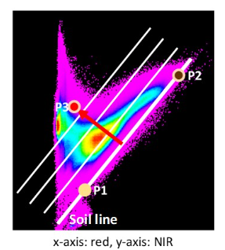

# 1. Preparation

- Open a new R-file or Rmd-file and save it. Fill in and run the requested R commands and comment as you like. Please, try to solve the exercises on your own before you have a look at the solution.

- Install the package terra and load it.

```r
#install.packages("terra")
library(terra)
```

- Set the working directory to the folder where today’s data are located on your computer. Remember to use the right folder delimiter (\\ or /)
```r
setwd("W:\\Path\\2\\Your\\folder")
```

---

# 2. Open a satellite image

- Open the Sentinel2 image. The given data are surface reflectance data, which means they corrected for observation geometry, as well as atmospheric and topographic effects. The data are saved in a range of 0 to 10000. To work with reflectance values in % we are dividing the data by 100.

If you would like to know more about different processing levels of Sentinel-2, please, have a look here: [https://documentation.dataspace.copernicus.eu/](https://documentation.dataspace.copernicus.eu/)

```r
image <- rast("sen2r_berlin_20230908_v2.tif")
image <- image/100
```
---

# 3. Google Earth (GE)

- Open Google Earth and open the file studyarea.kmlthat illustrates the boundary of the study area. Have a look at the area and try to differentiate land cover and land use types. For those of you who are interested in how created the boundary:

```r
img.boundary <- as.polygons(ext(image))
crs(img.boundary) <- crs(image)
img.boundary.utm <- project(img.boundary,crs("EPSG:4326"))
writeVector(img.boundary.utm,"studyareatest.kml",layer = "studyarea", overwrite = TRUE)
```

- Open as well `landcover.kml`. I have already prepared 4 polygons representing 4 land cover types. Add at least 6 other polygons.

- Prepare polygons that represent the different land cover/land use types. Rename the polygons according to the land cover/ land use they represent:
    - Forest
    - Grassland
    - Agriculture (differentiate between different types, e.g.agricultural fields that are barren or vegetated in Google Earth)
    - Settlements (industrial, residential)
    - Water (lakes, river) eventually open soil areas

- Save the polygons as kml-file (not kmz!)

---

# 4. Open a kml-file and Plot it

- The kml-file can be opened with the same function as a shapefile.

```r
landcover <- vect("landcover.kml")
```

- Compare the coordinate systems of the polygons and the image data. If necessary transform the projection system of the polygon data. Using an if-statement can be used to combine both functions.

```r
if (crs(landcover) != crs(image)){
landcover.utm <- terra::project(landcover, image)
}
```

- Write the land cover polygons to a shapefile using `writeVector()`

```r
writeVector(landcover.utm,"landcover_utm.shp",layer = "landcover", overwrite = TRUE)
```

- Plot the Landsat image and add your polygons. Mine are very small, so it might be hard to see them.

```r
plotRGB(image, r=8, g=3, b=2, stretch="lin")
plot(landcover.utm, add=TRUE, col = "green")
```

---

# 5.Calculate Mean Reflectance Spectra

Extract for each polygon the mean reflectance spectra for the image using extract() with the argument `fun=mean`

```r
image.extract <- extract(image, landcover.utm, fun=mean)
```

- Have a look at the result. How are the results saved? Optionally, you may add the polygon names from the kml-file using the function `row.names()` and the column names using `names()`

```r
names(image.extract) <- c("ID", "blue", "green", "red", "RE1", "RE2", "RE3", "NIR_b", "NIR_a", "SWIR1", "SWIR2")
row.names(image.extract) <- c(landcover.utm$Name)
image.extract
```

- Row entries of data.frames might be addressed using `dataframe.name[row,]` or `dataframe.name[rowname,]`.

```r
image.extract[2,]   # addressing a list entry using double brackets
image.extract["Lake",]  # adressing the same entry using the name
```

- Within the rows you may select 1 or several elements with e.g. `dataframe[row,column]` or `dataframe[row, columnstart:columnend]`

```r
image.extract[2,3] # addressing a list entry using double brackets

image.extract[2,3:5]

image.extract[2,c(3,4,5)]
```

---

# 6. Illustrate Mean Reflectance Spectra

- Create a plot that illustrates the mean reflectance spectra of the land cover/land use polygons for July.

    - Remember to use the `lines()` function when plotting additional spectra.
    
    - Please, add a legend illustrating the land cover types of your polygons.
    
    - Adapt the x-axis using the central wavelengths of the Landsat bands. These should be available from last week’s seminar.
    
    - Adapt as well the y-axis. We use level2 data. This means surface reflectance is scaled between 0 and 10000 (=100% reflectance). If the plot looks a bit weird (e.g. does not show the axis), you may use the command dev.off() which resets the plot properties. After applying this command, the plot should look fine. `dev.off()` does also cancel the `par()` settings that you might have applied.

To make it a bit more convenient, we get rid of the ID column and convert the data.frame to a matrix. This makes it easier to handle the data for instance for plotting purposes.

```r
image.extract.alternative1 <- as.matrix(image.extract[,2:11])

image.extract.alternative2 <- as.matrix(image.extract[,-1])

image.extract <- image.extract.alternative1
```

- Hint: The plots are created for a kml with 10 polygons. If you use more or less polygons remember to change the plotting functions accordingly.

- The colors are arbitrary, change according to your preferences.

```r
#dev.off() #--> use this command if you work with a normal R-script. In RMD this is often not necessary.

lambda<-c(490,560, 665, 705, 740, 783, 842, 865, 1610, 2190)

landcover_col <- c("forest green", "blue1", "light blue", "grey", "brown", "forestgreen", "darkseagreen", "red", "black", "dark orange")

plot(lambda, image.extract[1,], xlab="Wavelength [nm]", ylab="reflectance (%)", main="reflectance spectra", sub="July", xlim=c(400,2700), ylim=c(0,30), col=landcover_col[1], lwd=2, type='b')
lines(lambda, image.extract[2,], 
      ylab="grey value",
      xlab="wavelenght [nm]", type='b', col=landcover_col[2], lwd=2)
lines(lambda, image.extract[3,], 
      ylab="grey value",
      xlab="wavelenght [nm]", type='b', col=landcover_col[3], lwd=2)
lines(lambda, image.extract[4,], 
      ylab="grey value",
      xlab="wavelenght [nm]", type='b', col=landcover_col[4], lwd=2)
# lines(lambda, image.extract[5,], 
#       ylab="grey value",
#       xlab="wavelenght [nm]", type='b', col=landcover_col[5], lwd=2)
# lines(lambda, image.extract[6,], 
#       ylab="grey value",
#       xlab="wavelenght [nm]", type='b', col=landcover_col[6], lwd=2)
# lines(lambda, image.extract[7,], 
#       ylab="grey value",
#       xlab="wavelenght [nm]", type='b', col=landcover_col[7], lwd=2)
# lines(lambda, image.extract[8,], 
#       ylab="grey value",
#       xlab="wavelenght [nm]", type='b', col=landcover_col[8], lwd=2)
# lines(lambda, image.extract[9,], 
#       ylab="grey value",
#       xlab="wavelenght [nm]", type='b', col=landcover_col[9], lwd=2)
# lines(lambda, image.extract[10,], 
#       ylab="grey value",
#       xlab="wavelenght [nm]", type='b', col=landcover_col[10], lwd=2)


legend('topright', title='Landcover', 
       legend=row.names(image.extract),
       fill=landcover_col,
       cex = 0.8, bty="n") 
```

---


# 7. Feature Space

Create a scatterplot (in remote sensing we name it **feature space**) between the red and the green band. Select four spectra (**(a) water**, **(b) vegetation**, **(c) settlement**, **(d) soil** -or alternatively, one of your other prepared land cover types) and plot them within the feature space. Similarly to the function `lines()` the function `points()` allows adding point data to a diagram. You may set the argument `maxcell` to increase the number of pixel data used for the feature space. If you set the number very high, creating the diagram may take a little while. In this example I used all spectra but as mentioned before, you may restrict yourself to four land cover types.

```r
#dev.off() #--> use this command if you work with a normal R-script. In RMD this is often not necessary.

# feature space green (band 2) vs. red (band 3)
plot(image[[2]], image[[3]],  xlab="green", ylab="red", xlim=c(0,40), ylim=c(0,40), maxcell = 1000000,  col= "gray35")
points(image.extract[1,2],image.extract[1,3], col=landcover_col[1], cex=2, pch=19)
points(image.extract[2,2],image.extract[2,3], col=landcover_col[2], cex=2, pch=19)
points(image.extract[3,2],image.extract[3,3],  col=landcover_col[3], cex=2, pch=19)
points(image.extract[4,2],image.extract[4,3],  col=landcover_col[4], cex=2, pch=19)
# points(image.extract[5,2],image.extract[5,3],  col=landcover_col[5], cex=2, pch=19)
# points(image.extract[6,2],image.extract[6,3],  col=landcover_col[6], cex=2, pch=19)
# points(image.extract[7,2],image.extract[7,3],  col=landcover_col[7], cex=2, pch=19)
# points(image.extract[8,2],image.extract[8,3],  col=landcover_col[8], cex=2, pch=19)
# points(image.extract[9,2],image.extract[9,3],  col=landcover_col[9], cex=2, pch=19)
# points(image.extract[10,2],image.extract[10,3g],  col=landcover_col[10], cex=2, pch=19)

legend('topright', title='Landcover', 
       legend=row.names(image.extract),
       fill=landcover_col,
       cex = 0.8, bty="n")
```

---

# Homework

## 1. Feature Space

Create two more feature space plots

- red vs. NIR
- NIR vs. MIR 1 / SWIR 1

a. Compare the feature spaces regarding their information contents, i.e. are the bands correlated?

b. Where are the reflectance values of the four land cover types located. Are all of them separable in the three feature spaces?

```r
# your code
```

## 2. NDVI

- Calculate the NDVI and plot it. Adapt the argument `range` if necessary.

- Change the color representation as you wish

```r
# your code
```

- Reclassifiy the NDVI into two classes: **(i) water** and **(ii) non-water**. Try to find a threshold that nicely separates water from non-water (have a look at the SRTM exercise if you do not remember how to split data into classes). Are you satisfied with the result? If not what may be reasons?

```r
# your code
```

## 3. EVI

The EVI is calculated as following:
**EVI=G∗((ρNIR−ρRED)/(ρNIR+C1∗ρRED−C2∗ρBLUE+L))**

where the parameters are G = 2.5, C1 = 6, C2 = 7.5 and L = 1 (after Huete et al. 2002).

- Calculate the EVI and plot it.

- Hint: The EVI requires reflectance data scaled between 0 and 1. Always check before you calculate the EVI

```r
# your code
```
 
## 4. PVI

### Intro

The perpendicular vegetation index (PVI) is used to describe vegetation amount in a 2-dimensional space defined by the reflectance in the red and near infrared spectral regions. The PVI is defined as the distance of an observation perpendicular to the soil line.

A line in two dimensions can be parameterised by its slope **a** and intercept **b** according to the equation **y=a∗x+b**. To define the soil line in the 2-dimensional space of our red - near infrared scatterplot, where the x-axis represents the red band and the y-axis represents the near infrared band, we could choose two points representing dark and bright soil, like P1 (X1, Y1) and P2 (X2, Y2) in the example below:



- These two points can be employed to derive the slope of the soil line **a=(Y2−Y1)/(X2−X1)**, where **a** is the slope of the line.

- The intercept **b (x = 0)** can be derived as follows **b=Y1−a∗X1**

If the soil line is parameterised in this manner, the formula to compute the PVI is given by:

**PVI=((ρNIR−a∗ρRED−b))/(√1+a2)**

where **ρNIR** and **ρRED** are the reflectances in the near infrared and red spectral bands. The lines sketched in the figure above are lines of equal PVI. The soil line itself is the line where the PVI is zero.

# Derivation of the soil line

Define the soil line for the Landsat OLI reflectance image by (a+b) determining two points in its feature space (of the red and the NIR band) representing dark and bright soil, and then (c) use the point-slope equation to determine the line’s parameters and (d) Compute the PVI for the image by applying the equation above using the parameters you obtained for the soil line.

### a. Plot the feature space between the red band and the NIR band.

- Using the function `par(mfrow = c(1, 1), pty="s")` you force the plot to be square.
- The function `grid()` may be used to add grid lines to the plot.
    
```r
# your code
```

### b. Inspect the soil line.

- Define two points, one for a dark soil and one for a bright soil.
- Plot them in the feature space.
    
- Hint: If you are using R markdown and put the code in several chunks make sure to re-plot the feature space first. Unfortunately, plots can not be created using several chunks.

```r
# your code
```

### c. Derive the soil line by calculating gain **a** and intercept **b**.

```r
# your code
```

### d. Calculate the PVI and plot it.

```r
# your code
```


## 5. NDVI vs. EVI (vs. PVI)

- Create 2d-Scatterplots to compare the three indices by creating scatterplots. Describe the relationship of the different indices and the implications.

- What are the disadvantages of the NDVI compared to more enhanced indices like the EVI and the PVI?

```r
# your code
```
---


