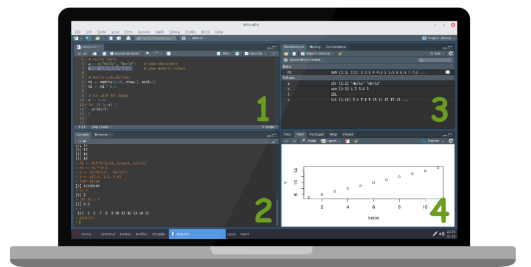
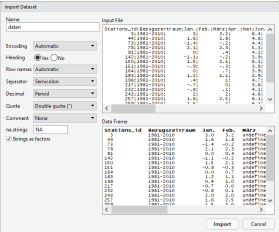

# 1. Course contents

This course is aimed at all those who have had no or very cursory contact with script-based programming but still want to analyze and visualize data professionally!

The programming language R is a very good choice for these tasks - and with millions of users one of the world’s leading programming languages for Data Science.

Geographic problems are also an excellent way to learn the basic tools of `R`: Often, time series, image data or modeling have to be evaluated statistically and the insights gained have to be visualized in an optimal way.

What are the learning objectives of this introduction?

- Getting to know the development environment RStudio

- Gain an understanding of basic data structures in `R`

- Import “real world” data, edit, analyze and export results

For this we will use data sets of the German Weather Service (DWD), which show the climate of the last 50 years in Germany. From downloading and importing the data into R, to visualization and statistical analysis, to exporting the results, the following document describes all necessary steps in detail and with the help of the code fragments also completely reproducible.

At this point, reference should of course be made to the many good, already existing online tutorials as well as the relevant literature around the topic `R`. Building on the knowledge of this course, the e-learning course SOGA (Softwaregestützte Geodatenanalyse) of the FU-Berlin is highly recommended. This course focuses more on the statistical and spatial analysis of geodata!

We wish you a lot of fun and good success!

---

# 2. Programming Language R

`R` is an object-oriented, interactive programming language and environment that can be used for statistical analysis, scientific graphics, and simulations. It was already released in 1993, is open-source (thus completely free of charge), one of the most widely used languages and is based on the language S. Currently, the R Development Core Team is responsible for the further development of R.

Via the official network CRAN (The Comprehensive R Archive Network) R is enormously extendable in its (geo-)statistical functionality. There are over 16.000 different extensions, called “packages”, available for free.

## 2.1. Download R & RStudio

`R` can be downloaded here: [https://cran.r-project.org/](https://cran.r-project.org/) 

For the operating systems Windows and Mac OS X, precompiled executable files are available on the respective linked websites. When executing the respective file, an installation wizard opens that guides you through the installation of the basic version of R including the most important packages. All default settings can be used here without hesitation. Under Linux the installation can be done e.g. follow these instructions: [https://linuxhint.com/install-r-and-rstudio-ubuntu/](https://linuxhint.com/install-r-and-rstudio-ubuntu/)

Once the installation is complete, R would theoretically be ready to go, however, it is recommended to use an integrated development environment (IDE) for working with R, such as RStudio. RStudio offers a number of advantages, e.g. the convenient visualization of mappings, the immediate execution of code fragments, the color highlighting of syntax in the code, and much more.

Recommended is the non-commercial open-source licensed Desktop Edition, which can be obtained from the official website for all operating systems. https://www.rstudio.com/products/rstudio/download/#download

## 2.2. RStudio Layout



The default view of RStudio consists of four working areas:

  1. The script window: in this area you can create and save executable codes. Code can be marked here and executed with a left click on Run in the upper right corner of th window or also with Ctrl + Enter.

  2. The console window: here the R-code is executed. Any input is confirmed by pressing the Enter key and executed immediately.

  3. The environment window: Here all available objects are displayed, which are created in the working directory during the session. By left-clicking on the respective object, it can be displayed or its properties can be displayed.

  4. This area contains some functions, like a file explorer (Files), the possibility to view plots and interactive elements directly in RStudio (Plots & Viewer), to install and manage extensions (Packages) and the help function (Help). In the Plots tab, the created plots can be navigated through using the arrow keys in the upper part of the window.
    
## 2.3. Manage Packages

For data visualization we will use an external package here, which we first need to download, install and activate in the current R session. Most of this is done for us by RStudio. In the fourth window of RStudio, there is an option under “Packages” to view, activate (box to the left of package name) or delete (cross to the right of package name) the packages that are already installed. At the top of the window we can search for the corresponding package name in the main database CRAN via Install. We will need the package ggplot for advanced visualization of data in this course.

Download and installation can also be done script-based with install.packages(). Attention: We have to execute the following lines only once! After that the package is permanently installed in R. With library() all packages installed on the computer are listed.

```r
install.packages("ggplot2")

library() 
```


In each session with R, however, we need to activate the required packages, in effect committing them to R’s memory, in order to access the functions within the package. This is done via library(name.of.package). Note: If you look at both commands again, you will notice that in the first case the package is in quotes, in the second case it is not! With search() all packages activated in the session are listed.

```r
library(ggplot2)

search()  
```
---

# 3. Calculate with R

R can also be used as an ordinary calculator. The desired operators can be entered directly into the console of RStudio. After pressing the ENTER key, the result is immediately displayed in the console. In this document, the results are always commented out with two diamond symbols ## for better readability.

```r
# diamonds allow commenting and note taking directly in the R code! :)

19 + 23      # Addition
## [1] 42

34 - 22      # Subtraction
## [1] 12

27 / 9       # Division
## [1] 3

6 * 8        # Multiplication
## [1] 48

(2 + 3) * 4  # Brackets
## [1] 20
```

The number in square brackets in front of the actual result refers to the length of the corresponding output (the index), which here corresponds to only a single numeric value in each case, hence the [1]. The rules of operator sequences (e.g. dot before dash) apply when linking several arithmetic operations, of course!

Besides the standard operators there are several other operators defined in R. In the following the syntax of the most important ones is shown:

| Operator | Description |
|----------|-------------|
| `?` | Help function |
| `+ - * / ^` | Addition, subtraction, multiplication, division, exponentiation |
| `!` | Negation mark |
| `< > <= >= == !=` | Smaller, larger, smaller equal, larger equal, equal, unequal |
| `& \|` | Logical operators: AND, OR |
| `<-` | Variable assignment from right to left |
| `~` | Definition of dependencies in model formulas |
| `:` | Create sequences |
| `%%` | Partition residue |
| `[ ] [[ ]] $ @` | Indexing within vectors, matrices and data frames |

If one does not know the use of a character or a function, e.g. the character `:`, an explanation can be called at any time in the console via `?":"` or via `help(":")`.

---

# 4. Variable Assignments

If previous results are to be reverted to, the last entries can be accessed in the console with the `up and down arrow keys` of the keyboard, modified if desired and executed again with Enter.

In most cases, however, it is useful and necessary to store the results temporarily in order to be able to access them later. In such cases variables help. These are defined in R with the `<-` operator. We do not get a direct output to the console, but we store the variable in the temporary workspace. Thus the variable should be visible under Values in the Environment window in the upper right corner of RStudio.

```r
x <- 8 + 7    # Assignment for variable x

y <- 4 * 2    # Assignment for variable y
```

We get the value of the variable only when we call the name of the same or look into the environment window. Further calculations with the variables are also possible.

```r
x             # Call x
## [1] 15

y             # Call y
## [1] 8

x + y         # Addition of x and y 
## [1] 23


my.variable <- x + y

my.variable
## [1] 23
```

A convention in R is to include dots in variable names (my.variable). This serves only for a better overview, especially if many variables exist, and has no deeper meaning apart from that.

---

# 5. Functions

There are several standard arithmetic functions and constants in R, which make statistical analysis very efficient. Functions are always called with round brackets. In front of the parentheses is the function name and inside the parentheses are the input arguments. Of course, previously created variables can also serve as input in functions. 
Some examples:

```r
sqrt(64)      # Square root
## [1] 8

exp(3)        # Exponential
## [1] 20.08554

log(17)       # Logarithm (Base e)
## [1] 2.833213

log10(x + y)  # Logarithm (Base 10)
## [1] 1.361728

pi            # Constant Pi
## [1] 3.141593

round(pi)     # Rounds
## [1] 3
```

A great strength of R is that users can create and call functions themselves. This is among other things useful when operations need to be performed very often and at different places in the script.

Let’s write a function that calculates a normalized ratio between two numbers! The best way to do this is to copy the following code into the script window, select everything and then execute the code. The function should then appear in the Environment window.

```r
myFunction <- function(var1, var2){
  
  x <- (var1 - var2) / (var1 + var2)
  
  return(x)
}
```

Explanation: By means of function() a new function is created and assigned to any variable (e.g. “myFunction”). The two arguments var1 and var2 are initially placeholders for variables that are not assigned until the own function is called. Between the curly brackets the operations of the function are defined. Intermediate results, like the x in our example, exist only locally within the function - they do not appear in the environment window. Only the return function can be used to write a result out of the function. 
The call is made via:

```r
result <- myFunction(42, 13)

result
## [1] 0.5272727
```

We have to consider that the function needs two arguments (numeric values) at the call to assign var1 and var2 in the function. If we give the function only one argument, an error message is issued. All functions must be defined before they are called! During the course we will get to know even more functions.

---

# 6. Data Types

This chapter introduces the data types in R in a compressed form and gives an overview of how these data can be “indexed” and evaluated. This is the cornerstone for later scripting and helps fundamentally in the interpretation of any error messages and thus in debugging!

A very good overview of data types and their most important properties is also provided by the official cheat sheets.

In R there are six atomic vector types. “Atomic”” in this context means that the vectors contain only data of a single data type:

- `character` e.g. “Time”, “Room”, “R is cool”

- `numeric/double` e.g. 3, -8, -14.4, 56.8

- `integer` e.g. 5, 9, 23, 654

- `logical` e.g. TRUE, FALSE

- `complex` e.g. 1 + 2i, 3-6i

- `(raw)` (raw sequences of bytes)

Everything that exists in R is an object, which in turn belongs to certain classes. This is due to the fact that R is subject to an object-oriented paradigm. Within this course, however, we will only go into the aspects of object-orientation that are relevant to us, so as not to go beyond the scope.

Objects have various properties, or attributes, such as column names, dimensionality, length, or class membership, and many more. These attributes can be viewed with the following functions, among others:

- `attributes(MyObjectName)`

- `typeof( ... )`

- `class( ... )`

- `length( ... )`

- `dim( ... )`

In R data can be represented in different structures. Four data types are differentiated: `vector`, `matrix`, `list` and `data frame`. A conversion of these is possible among themselves with the appropriate functions (`as.vector()`, `as.matrix()`, `as.list()` and `as.data.frame()`). In the following the structure and use of these data types will be discussed.

## 6.1. Vector

A vector is a simple collection of elements (e.g. character, integer, numeric), where only objects of the same class are included. You can think of a vector as a string of cells containing data. Vectors of the different classes can be created using the c()-function (“c” like combine):

```r
a <- c("Hello", "World")    # character/ string Vector
class(a)
## [1] "character"

b <- c(1.3, 5.6, 3.0)       # numeric Vector
class(b)
## [1] "numeric"

c <- c(42L, 99L, 46L)       # integer Vector 
class(c)
## [1] "integer"

d <- c(TRUE, TRUE, FALSE)   # logical Vector
class(d)
## [1] "logical"

e <- c(1 + 2i, 3-6i)        # complex Vektor
class(e)
## [1] "complex"
```

Integer values must be explicitly declared with an “L”, otherwise they are considered to be numeric or double.

If several classes are combined in a vector, conversion to a uniform class is forced:

```r
ab <- c("Hello", 1.3, "World", 5.6)   
class(ab)
## [1] "character"

ab
## [1] "Hello" "1.3"   "World" "5.6"


cd <- c(TRUE, 45L, FALSE, 13L)
class(cd)
## [1] "integer"

cd
## [1]  1 45  0 13
```

It is important to note that the elements are then partially modified (TRUE becomes a 1)!

A conversion between the classes is also possible. But if we try e.g. a character vector to numeric values, NA values (NA for not available) are introduced:

```r
x <- c(0L, 1L, 2L, 3L, 4L, 5L) 
x
## [1] 0 1 2 3 4 5

x <- as.character(x)
x
## [1] "0" "1" "2" "3" "4" "5"

y <- c("R", "is", "fun")
y
## [1] "R"     "is"    "fun"

y <- as.numeric(y)
## Warning: NAs generated by conversion
y
## [1] NA NA NA
```
### 6.1.1. Indexing in a Vector

To address individual elements in our vector, we have to “index” it. Indexing is done in R with the square brackets [ ]. We start counting at the index number 1 - so we get the first element of the vector with [1]. In other programming languages, e.g. C, Java or Python, the zero-based index rules - means: counting starts from 0! If the index number is chosen larger than the length of the vector, NA values are obtained. Since a vector is one-dimensional, we only have to write a number as index in the square brackets to retrieve the respective entry. A minus sign in front of the index number leads to the exclusion of the respective entry.

```r
x <- c(4, 2, 7, 9, 3) 
x
## [1] 4 2 7 9 3

x[1]           # the first element 
## [1] 4

x[-3]          # all elements except the third
## [1] 4 2 9 3

x[2:4]         # from the second to the fourth element
## [1] 2 7 9

x[c(2, 5)]     # the second and fifth element
## [1] 2 3
```

### 6.1.2. Calculating with Vectors

Calculating with numerical vectors is done element by element. If we multiply a vector e.g. by the value 5, we again get a vector in which every single element has been multiplied by 5:

```r
v1 <- c( 1,  3,  5,  7)

v1 * 5
## [1]  5 15 25 35

v1 + 100
## [1] 101 103 105 107
```

If we have two vectors of the same length, we can offset both of them element by element, so the first element of one vector is offset with the first element of the other and so on…

```r
v1 <- c( 1,  3,  5,  7)
v2 <- c(20, 40, 60, 80)
  
v1 + v2
## [1] 21 43 65 87

v2 * v1
## [1]  20 120 300 560
```

However, if the two vectors are of different lengths, the shorter one is “recycled” until the length of the other vector is reached (“recycling rule”)

```r
v3 <- c(1, 2, 3, 4, 5, 6, 7, 8, 9, 10)
v4 <- c(10, 1)  

v3 + v4
##  [1] 11  3 13  5 15  7 17  9 19 11
```

There are many useful functions in R, which simplify the fast data analysis. Here are some example functions that are already implemented in the base package and thus in every basic installation of R:

```r
v5 <- c(2, 4, 6, 8, 1, 3)

mean(v5)                    # arithmetic mean of the vector
## [1] 4

median(v5)                  # Median
## [1] 3.5

max(v5)                     # largest element
## [1] 8

min(v5)                     # smallest element
## [1] 1

sum(v5)                     # Sum of all elements
## [1] 24

quantile(v5)                # Quantile
##   0%  25%  50%  75% 100% 
## 1.00 2.25 3.50 5.50 8.00

var(v5)                     # Variance
## [1] 6.8

sd(v5)                      # Standard deviation
## [1] 2.607681

sort(v5, decreasing=TRUE)   # Sorting the numeric values
## [1] 8 6 4 3 2 1
```

Very useful! Reminder: If the functionality of a function is not quite clear, we can get help via the Help window in RStudio or via `?mean()`.

## 6.2. Factor

A special class is that of factors (factor): Factors represent categorical data and are useful for many statistical analyses as well as plotting data. When importing data into R, `strings` are automatically converted to factors by default.

```r
# disordered factor vector
f <- factor(c("good", "bad", "bad", "bad", "good", "good")
            )

class(f)
## [1] "factor"

f
## [1] good bad  bad  bad  good good
## Levels: bad good

str(f)
##  Factor w/ 2 levels "bad","good": 2 1 1 1 2 2
```

Factors are based on integer values, which we can display by the function str(): Each individual expression in the vector is a level and is assigned an integer value (in this case two, namely good is 1 and bad is 2). The assignment of the integer values is done alphabetically for character vectors. This order can also be defined manually and the levels can be assigned a fixed rank order via the ordered=TRUE argument:

```r
# ordered factor vector
f <- factor(c("good", "bad", "bad", "bad", "good", "good"),
            levels=c("bad", "good"),
            ordered=TRUE
            )

f
## [1] good bad  bad  bad  good good
## Levels: bad < good

str(f)
##  Ord.factor w/ 2 levels "bad"<"good": 2 1 1 1 2 2
```

## 6.3. Matrix

A matrix can be created via `matrix()` by defining the dimensionality via the attributes `nrow =` and `ncol =` when initializing a vector. A matrix is a two-dimensional data structure and is defined by the number of rows (`nrows()`) and columns (`ncol()`). It contains only elements of one single class.

```r
m <- matrix(1:6, nrow = 3, ncol = 2) 
m
##      [,1] [,2]
## [1,]    1    4
## [2,]    2    5
## [3,]    3    6

length(m)      # shows the length = the number of cells
## [1] 6

dim(m)         # shows nrow and ncol
## [1] 3 2
```

The colon in the expression 1:6 is a sequential operator, which in this case creates a vector from all integer values between 1 and 6 (`?seq()`). A matrix can also be created from vectors by using the `dim()` function to define the dimensionality:

```r
a <- 1:16
a
##  [1]  1  2  3  4  5  6  7  8  9 10 11 12 13 14 15 16

dim(a) <- c(2,8)
a
##      [,1] [,2] [,3] [,4] [,5] [,6] [,7] [,8]
## [1,]    1    3    5    7    9   11   13   15
## [2,]    2    4    6    8   10   12   14   16
```

Or we connect two vectors via `cbind()` (column bind) or `rbind()` (row bind) (if the vectors do not have the same length, NA values would be padded accordingly).

```r
x <- c(23, 44, 15, 12)
y <- c( 1,  2,  3,  4)

b <- cbind(x, y)
b
##       x y
## [1,] 23 1
## [2,] 44 2
## [3,] 15 3
## [4,] 12 4

c <- rbind(x, y)
c
##   [,1] [,2] [,3] [,4]
## x   23   44   15   12
## y    1    2    3    4
```

If more than two dimensions are needed, for example for image data, we use arrays. These behave like matrices, but have at least three dimensions (`help(array)`).

### 6.3.1. Indexing in a Matrix

The matrix behaves adequately to the vector, only that we now put two index numbers in the square brackets to address rows and columns. Both numbers must always be separated by a comma `[row, column]`. If we want all entries from one dimension, we simply leave the corresponding index numbers empty:

```r
m <- matrix(1:15, nrow = 5, ncol = 3) 
m
##      [,1] [,2] [,3]
## [1,]    1    6   11
## [2,]    2    7   12
## [3,]    3    8   13
## [4,]    4    9   14
## [5,]    5   10   15

m[ , 2]                     # extracts the second column
## [1]  6  7  8  9 10

m[3,  ]                     # extracts the third line
## [1]  3  8 13

m[1, c(2, 3)]               # Elements of the 1st row, 2nd & 3rd column 
## [1]  6 11
```

### 6.3.2. Calculating with Matrices

R is an equally powerful tool with regard to linear algebra - calculating with matrices. Adequately to the vectors whole matrices can be multiplied e.g. with a value (scalar multiplication) or element-wise several matrices can be calculated with each other. For the latter, however, the matrices absolutely need the same dimensionality (`dim()`)!

```r
m1 <- matrix(1:8, nrow = 2)
m1
##      [,1] [,2] [,3] [,4]
## [1,]    1    3    5    7
## [2,]    2    4    6    8

m1 * 5                     # Scalar multiplication
##      [,1] [,2] [,3] [,4]
## [1,]    5   15   25   35
## [2,]   10   20   30   40

m1 * m1                    # element-by-element multiplication
##      [,1] [,2] [,3] [,4]
## [1,]    1    9   25   49
## [2,]    4   16   36   64
```

The following functions are also useful:

```r
m2 <- matrix(1:6, nrow = 2)
m2
##      [,1] [,2] [,3]
## [1,]    1    3    5
## [2,]    2    4    6

colMeans(m2)               # arithm. mean of all columns
## [1] 1.5 3.5 5.5

colSums(m2)                # Sum of all columns
## [1]  3  7 11

rowMeans(m2)               # arithm. mean of all rows
## [1] 3 4

rowSums(m2)                # Sum of all rows
## [1]  9 12

t(m2)                      # transpose the matrix
##      [,1] [,2]
## [1,]    1    2
## [2,]    3    4
## [3,]    5    6

m3 <- matrix(1:6, ncol = 2)
m3 %*% m2                  # Matrix multiplication
##      [,1] [,2] [,3]
## [1,]    9   19   29
## [2,]   12   26   40
## [3,]   15   33   51
```

Matrix multiplications require that the inner dimensions of the two matrices are of equal length.

## 6.4. Lists

A list is a special form of a vector, which allows several elements of different classes at once. It thus serves as a kind of container for other objects, such as numbers, strings, vectors or matrices. A list can be created with the function `list()`. Element names can be given to existing lists via the `names()` function, in order to be able to index them later also via these names:

```r
l <- list(13L, "Hello", matrix(1:6, 2, 3))
l
## [[1]]
## [1] 13
## 
## [[2]]
## [1] "Hello"
## 
## [[3]]
##      [,1] [,2] [,3]
## [1,]    1    3    5
## [2,]    2    4    6

names(l) <- c("myInteger", "myString", "myMatrix")
l
## $myInteger
## [1] 13
## 
## $myString
## [1] "Hello"
## 
## $myMatrix
##      [,1] [,2] [,3]
## [1,]    1    3    5
## [2,]    2    4    6

str(l)
## List of 3
##  $ myInteger: int 13
##  $ myString : chr "Hello"
##  $ myMatrix: int [1:2, 1:3] 1 2 3 4 5 6
```

However, when creating the list, the element names can also be assigned at the same time:

```r
l <- list(`myInteger`=13L,
          `myString`="Hello",
          `myMatrix`=matrix(1:6, 2, 3)
          )
```

### 6.4.1. Indexing a list

Via the respective index number or via the assigned element name (if available) we can address the contents from the list by means of a double bracket `[[ ]]`. With a simple square bracket we would only get a part of the list itself, which would still belong to the class list:

```r
l[1]                        # 1. List part (list)
## $myInteger
## [1] 13
class(l[1])
## [1] "list"

l[[1]]                      # Extracted 1st element (integer)
## [1] 13
class(l[[1]])
## [1] "integer"

l[["myString"]]             # Element by name
## [1] "Hello"

l[[3]]                      # Extracted 3rd element (matrix)
##      [,1] [,2] [,3]
## [1,]    1    3    5
## [2,]    2    4    6

l[[3]][1, 2]                # ...with simultaneous indexing
## [1] 3
```

### 6.4.2. Edit a list

Lists can be extended (assign a value to a new index number or element name), and individual list elements can be deleted (assign NULL) or overwritten (reassign existing index/name):

```r
l["myNumeric"] <- 45.7325            # add new entry

l[1] <- NULL                         # 1. delete element (myInteger)

l["myString"] <- "World"             # overwrite existing element
```

## 6.5. Data Frame

The dataframe is the most used data type when editing databases and allows managing two-dimensional tabular data. How is it different from a matrix? Well, while a matrix can contain elements of only one class, a data frame can contain several classes. Each column in a data frame is like a list. Whenever external data is read into R, a `data frame` is created.

```r
df <- data.frame(
  "name"    = c("Ben", "Hanna", "Paul", "Arthur"), 
  "size" = c(185, 166, 175, 190),
  "weight" = c(110, 60, 76, 89)
  )

df
##     name size weight
## 1    Ben  185    110
## 2  Hanna  166     60
## 3   Paul  175     76
## 4 Arthur  190     89

length(df)                  # for data frames, the number of columns
## [1] 3

dim(df)                     # the dimensions (4 rows, 3 columns)
## [1] 4 3

nrow(df)                    # Number of rows
## [1] 4

ncol(df)                    # Number of columns
## [1] 3

str(df)                     # shows the structure (list of variables)
## 'data.frame':    4 obs. of  3 variables:
##  $ name  : Factor w/ 4 levels "Arthur","Ben",..: 2 3 4 1
##  $ size  : num  185 166 175 190
##  $ weight: num  110 60 76 89

summary(df)                 # statistical summary
##      name        size           weight      
##  Arthur:1   Min.   :166.0   Min.   : 60.00  
##  Ben   :1   1st Qu.:172.8   1st Qu.: 72.00  
##  Hanna :1   Median :180.0   Median : 82.50  
##  Paul  :1   Mean   :179.0   Mean   : 83.75  
##             3rd Qu.:186.2   3rd Qu.: 94.25  
##             Max.   :190.0   Max.   :110.00
```

The output of the function str() is interesting. It first shows us that we have 4 observations (Observations, obs., i.e. “Ben”, “Hanna”, “Paul”, “Arthur”) each with 3 variables (Variables, i.e. “Name”, “Height”, “Weight”). Furthermore, for each variable it is determined whether it is numeric (num) or categorical (factor). Is it a factor, the number of different values is also displayed (w/ 4 levels). Even more practical is the statistical summary for each individual column of the data frame via the function `summary()`!

### 6.5.1. Indexing a Data Frame

Columns can be addressed in a data frame either via the double square brackets `[[ ]]` using index numbers or directly via the name of the column (if available) using dollar signs `$`. In addition, the rows or columns can be addressed via single square brackets adequately to a matrix:

```r
df
##     name size weight
## 1    Ben  185    110
## 2  Hanna  166     60
## 3   Paul  175     76
## 4 Arthur  190     89

df[2]                                  # Output as data.frame
##   size
## 1  185
## 2  166
## 3  175
## 4  190

df[[2]]                                # Output as numeric
## [1] 185 166 175 190

df$size                                # Output as numeric
## [1] 185 166 175 190

df[ , 2]                               # Column, Output as numeric
## [1] 185 166 175 190

df[1,  ]                               # row, Output as data.frame
##   name size weight
## 1  Ben  185    110

df[1, 2]                               # row, Output as numeric
## [1] 185
```

Queries are also possible, here the whole strength of boolean operators comes into play:

```r
df
##     name size weight
## 1    Ben  185    110
## 2  Hanna  166     60
## 3   Paul  175     76
## 4 Arthur  190     89

df$size > 170
## [1]  TRUE FALSE  TRUE  TRUE

df[df$size > 170 , ]                     # all persons taller than 170 cm
##     name size weight
## 1    Ben  185    110
## 3   Paul  175     76
## 4 Arthur  190     89

df[df$size > 180 & df$weight < 100, ]   # logical AND concatenation
##     name size weight
## 4 Arthur  190     89

df[df$size > 188 | df$weight < 70, ]    # logical OR concatenation
##     name size weight
## 2  Hanna  166     60
## 4 Arthur  190     89

df[df$name == "Ben" | df$name == "Hanna", ] # logical OR concatenation
##    name size weight
## 1   Ben  185    110
## 2 Hanna  166     60
```

In R there are usually many ways that lead to the solution. Queries can also be made with the function `subset()`. Especially if several strings are searched, this is usually the more elegant way. The operator `%in%` matches one element with another element and tests if they are identical:

```r
subset(df, size > 170)                   
##     name size weight
## 1    Ben  185    110
## 3   Paul  175     76
## 4 Arthur  190     89

subset(df, name %in% c("Ben", "Hanna"))
##    name size weight
## 1   Ben  185    110
## 2 Hanna  166     60
```

### 6.5.2. Edit a Data Frame

It is often necessary to delete data from a data frame or to implement additional entries afterwards. For both tasks there are several possibilities in R. In the following two simple solutions:

```r
df2 <- df[ , -2]                       # delete column (variable) via index
df2
##     name weight
## 1    Ben    110
## 2  Hanna     60
## 3   Paul     76
## 4 Arthur     89

df3 <- subset(df, select = -c(weight, size))   # delete column (variable) via column name
df3
##     name
## 1    Ben
## 2  Hanna
## 3   Paul
## 4 Arthur

df4 <- df[-3, ]                        # delete row (observation) via index
df4
##     name size weight
## 1    Ben  185    110
## 2  Hanna  166     60
## 4 Arthur  190     89

df5 <- subset(df, !name %in% c("Ben", "Hanna")) # delete line (observation) via line input
df5
##     name size weight
## 3   Paul  175     76
## 4 Arthur  190     89
```

Excluding columns via the column name is also possible via the `subset()` function. Here we can specify the name of the column to be deleted (or also a vector with `c()` for several columns at the same time) via the argument `select=` with a preceding “-” character. The `!` character is a logical operator and negates a condition (`?"!"`).

Adding observations and variables is of course also possible:

```r
# Adding columns (variables):
df$gender = c("m", "w", "m", "m")
df
##     name size weight gender
## 1    Ben  185    110      m
## 2  Hanna  166     60      w
## 3   Paul  175     76      m
## 4 Arthur  190     89      m


# Adding lines (Observations):
newdata <- data.frame("name" = 'Lisa',
                      "size" = 180,
                      "weight" = 70,
                      "gender" = "w"
                      )

df <- rbind(df, newdata)
df
##     name size weight gender
## 1    Ben  185    110      m
## 2  Hanna  166     60      w
## 3   Paul  175     76      m
## 4 Arthur  190     89      m
## 5   Lisa  180     70      w
```

If a new row is to be added, the new data must have the identical structure as the existing data frame.

## 6.6. Missing Values

Missing values are indicated in R by the symbol `NA` (Not Available). Not possible values (e.g. division by 0) are described by the symbol `NaN` (Not a Number). Often the observations (rows) in a data frame are incomplete and with gaps. The correct handling of missing values is especially necessary in statistical evaluations. Many functions offer arguments for this to capture and ignore possible NAs. For testing purposes, we artificially define two elements as NA:

```r
df <- data.frame(
  "name" = c("Ben", "Hanna", "Paul", "Arthur"), 
  "size" = c(185, 166, 175, 190)
  )
df
##     name size
## 1    Ben  185
## 2  Hanna  166
## 3   Paul  175
## 4 Arthur  190

df[1:2, 2] <- NA              # Artificial generation of NA 
df
##     name size
## 1    Ben   NA
## 2  Hanna   NA
## 3   Paul  175
## 4 Arthur  190

mean(df$size)              # with NAs 
## [1] NA

mean(df$size, na.rm=TRUE)  # NAs are ignored
## [1] 182.5
```

It is often more useful to capture the observations with missing values and exclude them from the data set. For the detection of these we can e.g. create a logical vector with the function `is.na()`. This will output a TRUE for each NA value and a FALSE for each element present. We can then index our data frame via the logical vector:

```r
is.na(df$size)                # TRUE for NAs in column size
## [1]  TRUE  TRUE FALSE FALSE

df[is.na(df$size), ]          # Indexing via logical Output
##    name size
## 1   Ben   NA
## 2 Hanna   NA

df[complete.cases(df), ]      # all observations (lines) without NAs
##     name size
## 3   Paul  175
## 4 Arthur  190
```

---

# 7. Control Structures

Control structures allow for better control over the execution of our scripts. These include loops and queries and other structures

- `if`, `if else` and `else`
- `for`
- `while`
- `switch`
- `repeat`
- `break`
- `next`
- `return`

With the help function (e.g. `?return`) you can also get a first overview.

## 7.1. The if-command

The `if/else` command can be used to perform simple queries on all types of data. The Microsoft Excel counterpart to this would be the `if` function. In R, the syntax is as follows:

```r
x <- 3                                # Define variable x

x <= 4                                # Condition (logical Output)
## [1] TRUE

if (x <= 4) {
  print("x is smaller than or equal to 4!")    
} else {
  print("x is larger than 4!")        
}
## [1] "x is smaller than or equal to 4!"
```

Explanation: An if command requires three parts: the keyword if(), a condition that results in a single logical output (x <= 4), and a block of code in curly braces that is executed if the expression is TRUE. Thus, if the condition is TRUE, the code in curly braces will be executed after the if command. If the condition is FALSE, the code block will be executed after “else”. The `print()`-function prints the strings in the round brackets to the console window. We need the print function here so that the output can be written out of the if function, similar to the “return” (see Chapter 5). A vectorized (and thus usually more efficient) notation is the following:

```r
x <- c(3, 4, 5, 6, 7)                                

ifelse(x <=4, "x is smaller than or equal to 4!", "x is larger than 4!")
## [1] "x is smaller than or equal to 4!" "x is smaller than or equal to 4!"
## [3] "x is larger than 4!"              "x is larger than 4!"             
## [5] "x is larger than 4!"
```

By means of `ifelse()` the condition for every single element in a vector is determined and finally also a vector is output. This is extremely helpful, e.g. when we want to categorize data!

## 7.2. The for-loop

Loops are incredibly useful when certain tasks in the script need to be repeated very often. A `for` -loop is based on an iterable variable of defined length. But what does this mean? We define a random variable, for example i, with a starting integer value, e.g. 1

We let this integer value increment until a second integer value, e.g. 8, is reached. This is done using the sequence operator `:`.

```r
for (i in 1:8) {
  print(i)
}
## [1] 1
## [1] 2
## [1] 3
## [1] 4
## [1] 5
## [1] 6
## [1] 7
## [1] 8
```

The practical thing about this: The code in curly brackets is automatically executed one time with each increment (so eight times in total)! And meanwhile we can grab the value of our variable i and e.g. print it with `print()`. with `print()` or index a vector with it and much more!

```r
v <- c(23, 54, 12, 59, 67, 45)    # Create vector   

length(v)                         # Length of the vector (number of elements)
## [1] 6
  
for (i in 1:length(v)) {          # Iterator i from 1 to length(v)
  print(v[i])
}
## [1] 23
## [1] 54
## [1] 12
## [1] 59
## [1] 67
## [1] 45
```

It is also possible to assign the variable/iterator i immediately with the elements of the vector, instead of an integer-value for indexing:

```r
v <- c("R", "does", "always", "still", "fun")    

for (i in v) {
  print(i)
}
## [1] "R"
## [1] "does"
## [1] "always"
## [1] "still"
## [1] "fun"
```

However, the information in which run the loop is located is lost for the time being.

---

# 8. Data Analysis

Enough of theory and game data sets! It’s time for real-world data!

The following chapter presents a general workflow that leads us from data import, through the exploration of information, to the visualization of results. Long-term climate records of the DWD (Deutscher Wetterdienst) for Germany shall serve as example data sets. The data set as well as further information can be obtained via a server of the DWD: [https://opendata.dwd.de/](https://opendata.dwd.de/)

For explanatory information, click here: [https://www.dwd.de/DE/leistungen/cdc/cdc_ueberblick-klimadaten.html?nn=16102&lsbId=625220](https://www.dwd.de/DE/leistungen/cdc/cdc_ueberblick-klimadaten.html?nn=16102&lsbId=625220)

The following examples refer to the latest long-term average of the climate in Germany from 1981-2010.

## 8.1. Import

If external data is to be accessed, it is useful to define the working directory (wd) for the current R session beforehand to facilitate access to the local data. First we load the data set [“Temperatur_1981-2010.txt”](https://opendata.dwd.de/climate_environment/CDC/observations_germany/climate/multi_annual/mean_81-10/) from the DWD server and save it locally on the hard disk. We enter the file path to the dataset as a string (character) with quotes as argument into the function `setwd()`. Caution: all backslashes (`\`) in the file path must be replaced by either `\\` or `/`.

```r
setwd("V:\\WS_22_23\\Seminar1")           # wd define
# replace Backslashes "\" through "\\" or "/" !

getwd()                             # wd check
## [1] ""V:/WS_22_23/Seminar1""

# dir()                             # Show files in wd
```

RStudio facilitates the import of files. In the Environment-window, a wizard for the import can be started via “Import Dataset > From Text (base)…” If we select the file “Temperature_1981-2010.txt”, we will be asked for the arguments for the import in the next step. In general, the following arguments are important:

- `sep=` character separating cells
- `dec=` character which indicates decimal places
- `quote=` character for quotation marks in the data set

Conveniently, the import function in RStudio recognizes much of this automatically. The following settings are useful for our sample dataset:



The Quicklook at the bottom of the window gives an insight into the effects of the individual settings. To confirm our choice we press Import at the bottom of the window. The dataset is imported and the underlying command `read.csv("Temperatur_1981-2010.txt", sep=";")` is displayed in the console window in RStudio. This command can also be used to load the dataset script-based. Note: Due to the special characters in German, it is sometimes necessary to specify `encoding="latin1"` so that these characters can be read. It makes more sense to get into the habit of not using special characters in datasets and scripts, esp. if you work in an international environment.

```r
data <- read.csv("Temperatur_1981-2010.txt", sep=";", encoding="latin1")
```

The function `read.csv()` calls the function `read.table()` with a certain set of arguments. So the identical import is also possible with the function `read.table()` specifying the arguments (`?read.table()`):

```r
data <- read.table("Temperatur_1981-2010.txt",       
                   header = TRUE,        # first row as column name 
                   sep = ";",            # Separator for cells (\t = ASCII Tab)
                   quote = "\"",         # Quotation marks character (\" = ASCII ")
                   dec = ".",            # Decimal separator
                   fill = TRUE,          # Fills gaps with NA
                   comment.char = "",    # ignores comment symbols in the data set
                   encoding = "latin1"
                   )
```

Alternatively, data can also be loaded directly from the www via the URL into the cache. This way we skip the manual storage on the hard disk (assuming internet connection!):

```r
data <- read.csv("https://opendata.dwd.de/climate_environment/CDC/observations_germany/climate/multi_annual/mean_81-10/Temperatur_1981-2010.txt", fileEncoding="latin1", sep=";")

data <- data[-nrow(data), ]            # deletes last line containing only NAs 
```

## 8.2. Exploration

First, it helps to get an overview of the data frame via View(data) (or alternatively click the created object data in the Environment window):

```r
View(data)
```

More detailed information about the individual measuring stations is stored in a separate text file on the DWD ftp-server. This is called Temperatur_1981-2010_Stationsliste.txt and can be downloaded here:

```r
stations <- read.csv("https://opendata.dwd.de/climate_environment/CDC/observations_germany/climate/multi_annual/mean_81-10/Temperatur_1981-2010_Stationsliste.txt", encoding = "latin1", sep=";")

dim(stations)
## [1] 264   7

names(stations)
## [1] "Stations_id"   "Stationsname"  "geogr..Breite" "geogr..Laenge"
## [5] "Stationshoehe" "Bundesland"    "X"
```

Both data frames contain the column Stations_id. This can be used as a key to combine the information of both data frames using merge():

```r
data<- merge(data, stations, by = "Stations_id")

dim(data)
## [1] 264  22

names(data)
##  [1] "Stations_id"    "Bezugszeitraum" "Jan."           "Feb."          
##  [5] "März"           "Apr."           "Mai"            "Jun."          
##  [9] "Jul."           "Aug."           "Sept."          "Okt."          
## [13] "Nov."           "Dez."           "Jahr"           "X.x"           
## [17] "Stationsname"   "geogr..Breite"  "geogr..Laenge"  "Stationshoehe" 
## [21] "Bundesland"     "X.y"
```

We want to delete the variables reference period, data source and X.x and X.y, which are unimportant for us for the time being, because they do not offer us any added value. For this we use the function `subset()` again. The function `str()` gives an overview of the data types of our data set.

```r
data <- data[ , -c(2, 3, 17, 23)]

names(data)
##  [1] "Stations_id"   "Jan."          "Feb."          "März"         
##  [5] "Apr."          "Mai"           "Jun."          "Jul."         
##  [9] "Aug."          "Sept."         "Okt."          "Nov."         
## [13] "Dez."          "Jahr"          "Stationsname"  "geogr..Breite"
## [17] "geogr..Laenge" "Stationshoehe" "Bundesland"
```

Nothing runs perfectly right away!… A small problem arises at the latest when visualizing the data: Behind the values in the columns state and station name a lot of blanks are stored. This becomes clearer if we transform these columns with as.character() to a character vector and let us output it:

```r
x <- as.character(data$Bundesland)
head(x)                             # head() shows only the first 6 entries
## [1] "Nordrhein-Westfalen                     "
## [2] "Niedersachsen                           "
## [3] "Bayern                                  "
## [4] "Niedersachsen                           "
## [5] "Hessen                                  "
## [6] "Bayern                                  "
```

To delete the spaces we can use the function `gsub()` which deletes the spaces `" "`. Best we overwrite the columns with the new elements without spaces at the same time!

```r
data$Bundesland <- gsub(" ", "", data$Bundesland) 
data$Stationsname <- gsub(" ", "", data$Stationsname) 
```

With `names()` the variable names can be redefined if necessary:

```r
names(data) <- c("Stations_id","Jan", "Feb", "Mae", "Apr", "Mai", "Jun", "Jul", "Aug", "Sep", "Okt", "Nov", "Dez", "Jahr", "Stationsname", "lat", "lon", "Stationshoehe", "Bundesland")

str(data)
## 'data.frame':    264 obs. of  19 variables:
##  $ Stations_id  : int  3 44 73 78 91 142 150 151 164 183 ...
##  $ Jan          : num  3 1.6 -1.4 2.1 0 -1.1 1.5 -0.9 0 1.2 ...
##  $ Feb          : num  3.2 1.8 -0.2 2.3 0.4 -0.2 2.1 -0.3 0.7 1.1 ...
##  $ Mae          : num  6.4 4.8 4.4 5.3 4.1 3.9 6.1 3.8 3.9 2.9 ...
##  $ Apr          : num  9.5 8.5 9.1 9 7.7 8.1 9.5 8.3 8.5 6 ...
##  $ Mai          : num  13.6 12.7 14.4 13.2 12.3 13 14.3 13.3 13.4 10.4 ...
##  $ Jun          : num  16.2 15.3 17.1 15.7 15 15.9 17 16.2 16.1 14.2 ...
##  $ Jul          : num  18.4 17.7 18.9 17.9 17.2 17.8 19.3 18.3 18.5 17.1 ...
##  $ Aug          : num  18 17.3 18.2 17.5 16.6 17.3 18.8 17.5 17.9 17.3 ...
##  $ Sep          : num  14.6 13.8 13.8 13.9 12.8 13.1 14.3 13.2 13.9 14.1 ...
##  $ Okt          : num  11 9.6 9 9.9 8.7 8.6 9.9 8.5 9.2 10 ...
##  $ Nov          : num  6.6 5.4 3.6 5.7 4.1 3.2 5 3.4 4.1 5.5 ...
##  $ Dez          : num  3.7 2.3 0 2.7 1 0.1 2.2 0 0.8 2.3 ...
##  $ Jahr         : num  10.4 9.2 8.9 9.6 8.3 8.3 10 8.4 8.9 8.5 ...
##  $ Stationsname : chr  "Aachen" "Großenkneten" "Aldersbach-Kriestorf" "Alfhausen" ...
##  $ lat          : num  50.8 52.9 48.6 52.5 50.7 ...
##  $ lon          : num  6.09 8.24 13.05 7.91 9.34 ...
##  $ Stationshoehe: num  202 43.5 340 65 300 510 215 383 54 42 ...
##  $ Bundesland   : chr  "Nordrhein-Westfalen" "Niedersachsen" "Bayern" "Niedersachsen" ...
```

For further analysis, we copy the object data and call the copy ref10 (reference period 1981-2010).

```r
ref10 <- data
```

## 8.3. Visualization

The visualization of results is certainly one of the best aspects of R. Most objects can be visualized very easily using the implemented plot functions. As good as the visualization capabilities are, they can also be complex when needed. We will only look at a small part of the visualization potential.

Graphs are generated interactively in R. This means that the first call to a plot function generates a graph, which we can modify in appearance with subsequent functions or add additional data and content, such as legends, subsequently. The graphical arguments can be used to freely modify fonts, colors, display styles, axes, reference lines and much more. freely modifiable.

### 8.3.1. Scatter Plot

In R scatter plots and curve plots can be output as it were via the function `plot()`. For the positioning of a point in the plot the specification of in each case x and y coordinates in vector form is always a condition (`plot(x, y)`)! The vectors must have the same length.

::: {.panel-tabset}

## Plot I

We want to plot the temperature annual cycle using the example of the measuring station Berlin-Tempelhof:

```r
tempelhof <- ref10[ref10$Stationsname == "Berlin-Tempelhof", ]

temperature <- tempelhof[2:13]

month <- c(1:12)
  
plot(month, temperature)
```

## Plot II

Decisive for the type of display in the Scatter plot is the argument `type=` (see `?plot`).

- `p` - point representation
- `l` - line representation
- `b` - point and broken line together
- `c` - broken line
- `o` - points and continuous line
- `h` - similar to histogram
- `s` - stair steps
- `n` - no output to the plot

If we use e.g. `type=b` for our previous plot, we get:

```r
tempelhof <- ref10[ref10$Stationsname == "Berlin-Tempelhof", ]
temperature <- tempelhof[2:13]

month <- c(1:12)
  
plot(month, temperature, type="b")
```

## Plot III

By calling the command `plot()` the previous figure is overwritten. In order to visualize several data sets in one figure at the same time, we can make use of the interactive design of plots and add lines afterwards, e.g. with `lines()` to add lines:

```r
Berlin <- ref10[ref10$Stationsname == "Berlin-Tempelhof", ]
Berlin <- Berlin[2:13]

Muenchen <- ref10[ref10$Stationsname == "München-Stadt", ]
Muenchen <- Muenchen[2:13]

month <- c(1:12)
  
plot(month, Berlin)
lines(month, Muenchen)
```

## Plot IV

To investigate correlations, two continuous variables can also be plotted against each other in a scatter plot. In the following we want to plot the station height against the annual average temperature. Additionally we define the axis limits with `xlim`= and `ylim=`

```r
plot(ref10$Stationshoehe, ref10$Jahr, xlim=c(0, 1000), ylim=c(5, 12))
```

## Plot V

Adding a regression line is done quite quickly in R: The linear regression line can be determined with the function `lm()` (lm for linear model, see `?lm`) and drawn into the plot with `abline()`. For this the formula operator (`~`) is used again: To the left of it is the model output, to the right of it the explanatory variables (see `?"~"`) Another possibility is the `lowess()` function, which uses a locally weighted scatterplot smoothing and thus calculates on the basis of the k-nearest values in each case.

```r
plot(ref10$Stationshoehe, ref10$Jahr, xlim=c(0, 1000), ylim=c(5, 12))

linearmodel <- lm(ref10$Jahr ~ ref10$Stationshoehe)
abline(linearmodel, col="red")

localmodel <- lowess(ref10$Jahr ~ ref10$Stationshoehe, f=0.5)
lines(localmodel, col="blue")
```

## Plot VI

Advanced: With ggplot2 you can create a confidence interval via `stat_smooth()`, which uses a confidence level of 0.95 by default (and can be modified);

```r
library(ggplot2)

qplot(ref10$Stationshoehe, ref10$Jahr, xlim=c(0, 1000), ylim=c(5,12)) +
  stat_smooth(method="loess")
## Warning: Removed 9 rows containing non-finite values (stat_smooth).
## Warning: Removed 9 rows containing missing values (geom_point).
```

## Plot VII

R can also be used to create much more complex mappings and visualizations. One example is the correlation matrix using `pairs()`.

```r
pairs(~ Stationshoehe + Jahr + lat + lon, data=ref10)
```

:::

### 8.3.2. Histogram

A very simple and at the same time useful representation is the histogram. A histogram shows the frequency distribution of a variable and can be generated with hist() by specifying a column (variable). Thereby the values are automatically categorized into a certain number of classes to allow a bar representation.

::: {.panel-tabset}

## Histogram I

We want to determine the frequency distribution of the annual average temperature of all monitoring stations in the data set.

```r
hist(ref10$Jahr)
```

## Histogram II

The fineness of the gradations (number of classes) in a histogram can be modified with the argument `breaks =`:

```r
hist(ref10$Jahr, breaks = 50)
```

## Histogram III

By the argument `prob =` TRUE we get instead of the absolute frequencies a probability distribution of the values (note the y-axis!):

```r
hist(ref10$Jahr, breaks = 50, prob = TRUE)
```

## Histogram IV

We can also use additional packages with advanced visualization options, such as ggplot2:

```r
library(ggplot2)

qplot(ref10$Jahr, geom="histogram", binwidth = 0.2)
```

## Histogram V

The appearance of a histogram depends strongly on the number of breaks. Sometimes it is useful to display a kernel density estimate instead. This smoothes our histogram. To do this, we create an appropriate object using the `density()` function and plot it using plot(). With the argument `bw =` we can define the strength of the generalization (smoothing):

```r
plot(density(ref10$Jahr, bw = 0.5))
```

:::

### 8.3.3. Barplots

Barplots are used to visualize categorical data. The corresponding function is barplot().

::: {.panel-tabset}

## Barplot I

We first want to display how many measuring stations per federal state are contained in the data set. For this we use the `table()` function, which reflects the frequency of the elements in a column (ref10$Bundesland). We give this table to the function `barplot()`:

```r
number <- table(ref10$Bundesland)     

barplot(number[1:5])
```

## Barplot II

If too many bars are displayed, there is no longer enough space for the labels on the x-axis - they are automatically hidden. A solution for this is to rotate the labels of the x-axis with `las=2`. If the names of the states are too long, they will again be cut off at the bottom, because they “stick out” of the plot. With the `par()`-function we can define various general parameters for the plot, like the distances around the plot with `mar=c`(bottom, left, top, right):

```r
number <- table(ref10$Bundesland)     

par(mar=c(12, 4.1, 4.1, 2.1))   # Standard: c(5.1, 4.1, 4.1, 2.1)
barplot(number, las = 2)
```

## Barplot III

Advanced: Each bar can also be composed of several parts, which increases the information content. For example, let’s take a categorization of the altitude values with a gradation of 300 altitude meters each and store the values in a new column of our dataset, we can include this information in the `table()` function and visualize it in the bar chart:

```r
abstufung <- 300
ref10$hoehe.gerundet <- round(ref10$Stationshoehe / abstufung) * abstufung

anzahl <- table(ref10$hoehe.gerundet, ref10$Bundesland)

par(mar=c(12, 4.1, 4.1, 2.1))   # default: c(5.1, 4.1, 4.1, 2.1)
barplot(anzahl, las = 2, legend = rownames(anzahl))
```

A slightly different representation is achieved by the argument `besides=TRUE`:

```r
par(mar=c(12, 4.1, 4.1, 2.1))   # default: c(5.1, 4.1, 4.1, 2.1)
barplot(anzahl, las=2, legend=rownames(anzahl), beside=TRUE)
```

:::

### 8.3.4. Boxplot

A boxplot, or box-whisker-plot, is a very nice form of representation with high information density. By means of `boxplot()` such a graph can be generated.

::: {.panel-tabset}

## Boxplot I

We want to generate a boxplot for the annual mean of all stations in Thueringen:

```r
thueringen <- ref10[ref10$Bundesland == "Brandenburg" , ]

boxplot(thueringen$Jahr)
```

## Boxplot  II

Multiple columns as input to the boxplot function generate multiple boxplots side by side. Here the temperature distribution of all months based on all stations.

```r
boxplot(ref10[2:13])
```

## Boxplot III

With the syntax ~ we can have the boxplots generated according to certain group memberships. For example the temperatures in September in dependence of the federal state, we proceed as follows. With the arguments `xlim=` and `ylim=` we can specify the range of values on the respective axis.

```r
par(mar=c(12, 4.1, 4.1, 2.1)) 
boxplot(ref10$Sep ~ ref10$Bundesland, las=2, ylim=c(10, 16))
```
:::


### 8.3.5. Graphic Parameters

When it comes to the design of figures, the variety of options in R is enormous. In the following, we will look at the most important options for modifying our plots. However, there are many comprehensive online tutorials on this topic.

In R, global graphical settings for plots can be defined via `par()` (for parameter `?par`). These then remain active until the end of the session, unless they are changed again or reset using `dev.off()`:

```r
dev.off()                 # resets all settings 

par()                     # shows the current settings 
```

In addition, it is possible to make the graphical settings directly when calling one of the plot functions (e.g.: `xlim=`, `col=`, …). Possible options are then always listed with the respective help for the plot function. In this case the settings are only valid for the respective plot.

::: {.panel-tabset}

## Axes & Legends

We get better control over the axes by using the function `axes()`. When plotting ourselves, we first disable the drawing of the axes and then place them on our figure with `axes()`. Additionally we draw a box around our plot, a legend and a grid:

| Parameter | Description |
|----------|-------------|
| `xlim` | vector with min and max value on the x-axis |
| `y-lim` | vector with min and max value on the y-axis |
| `xlab` | x-axis title |
| `ylab` | y-axis title |
| `main` | main title |
| `sub` | sub-title / sub heading |

## Symbol & Lines

The appearance of the points in scatter plots can be influenced with the argument pch=. With pch=16 one would get e.g. filled circles would be obtained:

| Parameters | Description |
| ---------- | ----------- |
| `pch` | Symbols when plotting points (1-25) |
| `lty` | Line type (1-6) |
| `lwd` | linw width |

```r
plot(ref10$Stationshoehe, ref10$Jahr,
     xlim=c(0, 1100),
     ylim=c(5, 12),
     pch=seq(1, 25)
     )

linearmodel <- lm(ref10$Jahr ~ ref10$Stationshoehe)
abline(linearmodel, col="red", lty=3, lwd=6)
```

## Colors

In R colors are described either by an index, by a name, hexadecimal or as RGB values. The function `colors()` generates all available color names for us. There are some predefined color gradients from which we can extract n-any number of elements:

- `rainbow(b)`
- `heat.colors(n)`
- `terrain.colors(n)`
- `topo.colors(n)`
- `cm.colors(n)`

Recommended for color management is the package RColorBrewer or also this website.

| Parameters | Description |
| ---------- | ----------- |
| `col` | default plot color |
| `col.axis` | color for axis labelling |
| `col.lab` | color for x and y labels |
| `col.main` | color for title |
| `col.sub` | color for sub headings |
| `fg` | plot foreground colour |
| `bg` | plot background color |

```r
plot(ref10$Stationshoehe, ref10$Jahr,
     xlim=c(0, 1100),
     ylim=c(5, 12),
     xlab="Station altitude",
     ylab="Temperature, long-term mean",
     main="Correlation temperature altitude",
     sub="Korrelation between long-term mean temperature and terrain elevation",
     
     col=rainbow(nrow(ref10)),                 # by color palette
     col.axis="blue",                          # by name
     col.lab=colors()[127],                    # by index
     col.main="#1B9E77",                       # hexadecimal
     col.sub=rgb(0.2, 0.9, 0.3)                # by RGB
)
```

## Borders and Size

We define the size of the plot with `pin()` and the border areas around the plot with `mar()` or `mai()`. The border areas should be modified especially if e.g. axis labels are no longer in the print area and would be cut off.

| Parameters | Description |
| ---------- | ----------- |
| `mar` | Vector for margin size in text lines: c(bottom, left, top, right) |
| `mai` | Vector for margin size in inches: c(bottom, left, top, right) |
| `pin` | plot dimensions (height, width) in inches |

```r
par(pin=c(1,3))

plot(ref10$Stationshoehe, ref10$Jahr,
     xlim=c(0, 1100),
     ylim=c(5, 12)
)
```

```r
par(pin=c(5,2))

plot(ref10$Stationshoehe, ref10$Jahr,
     xlim=c(0, 1100),
     ylim=c(5, 12)
)
```

## Plot Combination

Using `par()` or `layout()` multiple plots can also be created in one main figure. Using `par(mfrow = c(nrow, ncol)` a matrix of nrow times ncol slots is created for arbitrary plots, which is filled row by row with the following plot functions:

```r
par(mfrow = c(2,2))

plot(ref10$Stationshoehe, ref10$Jahr)   # top  left
hist(ref10$Stationshoehe)               # top right
boxplot(ref10$Jan)                      # bottom left 
plot(ref10$Jahr, type="s")              # bottom right
```
:::

## 8.4. Export

All objects in the environment of the active session can be saved to disk and reopened later. This works either via the Environment window in RStudio, by pressing the disk icon and selecting a location, or script-based via the command. In this case the file extension RData must be used. The saving is done into the previously defined working directory `setwd()`.

```r
save.image(file="RmachtSpass.RData")  
```

Later the complete content of the environment can be loaded again:

```r
load("RmachtSpass.RData")   
```

In addition, it is very important to save your hard-worked plots as image files. Various rasterized file formats are available, such as JPG, PNG and WMF, but vector-based exports as pdf are also possible! A plot is saved via the following steps:

1. Open a device via `png()`, `bmp()` or `pdf()`
2. Plot the desired image
3. Close the device with `dev.off()`.

Due to the conversion, the images always look slightly different in the respective format than in RStudio. This may require corrections (e.g. through different par settings).

```r
# as pdf
pdf(file="myRcourseOutput.pdf")

plot(ref10$Jan, ref10$Feb)

dev.off()
## pdf 
##   2

# as png
png(file="myRcourseOutput.png")

plot(ref10$Jan, ref10$Feb)

dev.off()
## pdf 
##   2
```
